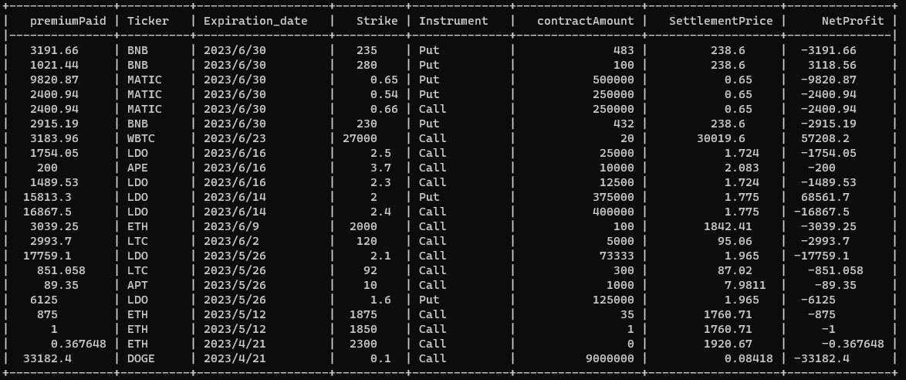

# AevoOTC

## Introduction

Analysis of Aevo alt option OTC trades PNL. 

## Usage
0. Create a .env file with `API_KEY=xxx` where `xxx` is your alchemy api key
1. (Optional) Go to alchemy [playground](https://composer.alchemy.com/?share=eJyVmMty4jgUht_FdRZAgODsgIRJV80kVJLuTXcXJcsHcEW2PJLchOnKu49kLtHlyNCbUDnn_3.rciTL_t2hG5KXndsOqE3nqlPoH549VSrnpezcfv.d_UVYDTpPGN1AsVuuQU2kBPUqSClXIKRWMZICa2U_rlCnV.4G5YQxviUlBdzJY9qcpoQZJtIkF2nz_QcUyYgiLT4nJOZjuk6oGcdnoJBXKtYqBMQ8Bfxbg1QLsiuIVCAmZXaHNzFGYq4yL2pGFDTTNduQco2OHoq1_d2.A61Nn1rMPhnbifKiqhU8E5GrnaV247Yig7ReL5UgFKaM07fp7oFIU8xHaQRo93isixREq8sBifjMCGO4vMlEVFY54GIbsD30wl0SSnldOpXmhH0_Nf0IOupnfBV1O3YKBZzZWb5kPnqIBjTPy5RIexNwwj6vKzwvdBX9Rfzu2pmY6qsE8VSBIGYc4xYB5vutAB5yqbiwS9VL_Jo1kQuRO9udEw54UIddy1d8JjANuhaQZFyLlkaQjumRfQ9Nx.RWpc9M.bb2JQJf7t3a1yiO_M94hkxUE0Xoec70Fh3uvGg6qv_br6PiJococU2MXgjOVyG_DyP8M_cKn65TBlG96AVD1jBRoewzheis_ZnumhkzT9Avvi9lBu_h2Rn_oifsK_BPnuEpzj0FH74Qafdp6rXVZk_0uxwWa6vPkbnISR7G5BLHE4s4fy0pg4vmPEqecT03zy1szPmwh5yaEjENsEv8YvtYDMQ87bderA4x6JxXtIpQynfb6Edowt9cT2GfL8i7fqFyc16cAyxAhO95FAl88jIv175yH.TZErbN4O63Xk.jJRFtTBZXLKDMdEOsRRPziJK_axWA.rBhROAiuOKUs2.68889zGJZXy31E57JFj8NRwDMo93gnNopS0Tv5gOHfB2ITCjg6qriQkF2XyqxW_gDb3BmQpHAZ1fSsFCPUZ_udf1Kpc.taL34WVvdnGZ0O.TAIR.KWDailnMunral83A07ennjHPhH6HduKd4nL.iTbUToeaFMOdQZkdDOiRRSvdqxhkDvyjRtKdvhqPNAQNiHs09RkS_z3nKl4oUp8lxhW7K1uXygbNMr5MV2mY07eptb0fpJGxNCWrJ9NcXeBu3G.cVFeiTtndacuO_4lewt9lRmxagn6i.KpF_BClXZ9a96aijOAVtVgIRdNOyNCOA41EXhb5h_Q90KU6UEnmq71zsuY4AtkdzTbG.QbCEdjSkvTsFKxiyK3.DcsIhr8szgE0sJEXsjYOmET1UjOxPV5G3ZzsXc2xtVECELvpvVG.nbOUW0uslZTmUKnyFI8lAKzfk2pc0sY_fV2adbLl469x2j3fOj6QIP04rIkjxzbjuL6NXghf7T4HbTve9qwnFj._bK0VpZppkmQCpBRqZ39_Nu0MYXffINLnP_mkymCe9.nB4d9e.6Q16w5vV5GaYmEsqxaucGtX3H1o4yG5Wyag7HtGkn.ZXCekPByTr94aDcdqjvVU.S5Jht09vkoH_HY9Ho_tBkiajNO2RcTYmPzo.dUc..gdL.lt0) and put the response to `data/tokenMintEvents.json`
This is because there's a limit for the maximum block range we can query(2k).
2. ```
   npm install .
   chmod +x lfg.sh
   ./lfg.sh
   ```

## Methodology
To get All OTC transactions, we only pay attention to the following event:

```
Address
0xfed805e631ab9ed2b94f91255dd2714157fa759d
Name
ShortOtokenMinted (index_topic_1 address otoken, index_topic_2 address AccountOwner, index_topic_3 address to, uint256 vaultId, uint256 amount)View Source

Topics
0 0x4d7f96086c92b2f9a254ad21548b1c1f2d99502c7949508866349b96bb1a8d8a
```

We first get all events emitted by address `0xfed805e631ab9ed2b94f91255dd2714157fa759d` 

```
{
  "jsonrpc": "2.0",
  "id": 0,
  "method": "eth_getLogs",
  "params": [
    {
      "fromBlock": "0x0",
      "toBlock": "0x10B5E39",
      "address": "0xFED805e631aB9Ed2b94F91255DD2714157fA759d",
      "topics": [
        "0x4d7f96086c92b2f9a254ad21548b1c1f2d99502c7949508866349b96bb1a8d8a"
      ]
    }
  ]
}
```

Then in extract_tx.js, we do:
1. get the timestamp of the tx from transaction hash => block number => block timestamp
2. get the premium of each option, this is done through checking eth_getTransactionReceipt 
3. get the minted option token, then aggregate all fields replated to that token, which looks like:

```
  {
    decimals: 8,
    logo: null,
    name: 'BNBUSDC 30-June-2023 230Put USDC Collateral',
    symbol: 'oBNBUSDC/USDC-30JUN23-230P',
    tokenHash: '0xe5b284a2b69c08f5f879640d85d3d69fa723f551',
    transactionHash: '0x1886e90924c7eaa411cd76925ae93f2a66fb66b1569abc25cf53d078bafef316',
    optionBuyerAddr: '0x7ca28c291c806c955f48cdd7445e65fd702acec6',
    transactionTimeStamp: 1687443407
  }
```

With these, we are ready to fetch the settlement price (if expired) for each option. We use the Binance endpoint can be queried like `https://data.binance.vision/data/spot/daily/klines/{ticker}USDT/{granularity}/{ticker}USDT-{granularity}-{date}.zip`

We download the market data with a granularity up to 1h and get the spot price at time `UTC 08:00`. All data are downloaded at `data` directory. The final aggregated PNL csv file is located in `result/TokenInfo_processed.csv`.

Here is the result up to June 30.



## Contact
Twitter [@0xJChen](https://twitter.com/0xJChen)
